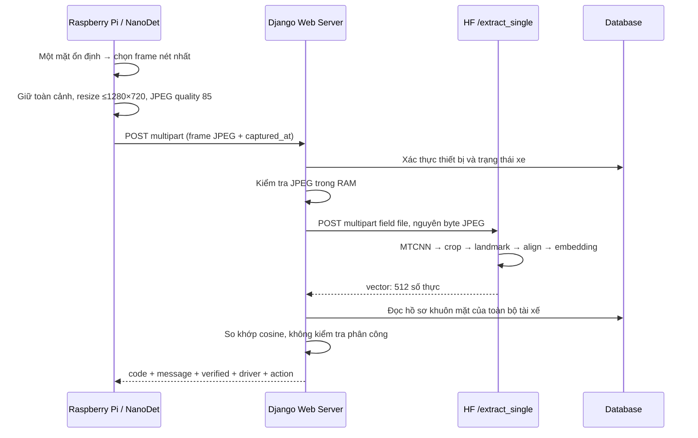

# Raspberry Pi → Web Server → HF: xác thực tài xế

## Luồng đã triển khai



Không lưu frame, embedding truy vấn hay kết quả xác thực vào DB/Cloudinary/file. DB chỉ cập nhật `Device.last_seen_at`. Không gửi RGB thô, base64, ảnh crop hoặc nhiều request cho từng đoạn byte. Server kiểm tra giải mã JPEG nhưng **không encode lại** ảnh gửi HF.

Kết quả này là xác thực tại thời điểm request, không tự tạo phiên lái hoặc mở khóa phần cứng. Không có token cấp quyền mở phiên được phát hành trong API này.

## Hợp đồng HF đã kiểm tra

Đọc trực tiếp [OpenAPI của HF](https://aiwho-embeddingresnet34.hf.space/openapi.json):

- `POST /extract_single`: multipart, **`file`** (số ít), trả `{"vector": [512 floats]}`.
- `POST /extract_profile`: multipart, **`files`** (nhiều ảnh), dùng khi đăng ký hồ sơ.
- Không lấy ví dụ cuối notebook làm request mẫu: notebook khai báo `url_extract` nhưng gọi `url`, và dùng sai tên trường cho single.

Server từ chối vector sai kích thước, NaN/Infinity, boolean hoặc toàn số 0. Hồ sơ đối chiếu phải được tạo bằng cùng model/phiên bản/preprocessing với `/extract_single`; nếu thay model, cần tạo lại embedding hồ sơ. HF hiện không cung cấp version model trong schema; bên vận hành phải giữ hai endpoint đồng bộ.

## Cấu hình

```dotenv
FACE_SINGLE_EMBEDDING_URL=https://aiwho-embeddingresnet34.hf.space/extract_single
FACE_SINGLE_FILE_FIELD=file
HF_API_TOKEN=
FACE_COSINE_THRESHOLD=<nguong-da-hieu-chinh>
FACE_COSINE_MARGIN=0.05
DEVICE_API_REQUIRE_HTTPS=false
DEVICE_API_CHECK_FRAME_AGE=false
```

`FACE_SINGLE_EMBEDDING_URL` mặc định suy ra từ thư mục của `FACE_EMBEDDING_URL` nếu đã cấu hình. Token HF chỉ cần khi endpoint yêu cầu. Ngưỡng cosine bắt buộc nằm trong `(0,1]`; chưa cấu hình thì trả `MATCHING_NOT_CONFIGURED`, không tự cho phép xác thực. Chọn ngưỡng bằng các cặp cùng người/khác người từ camera thực tế. Ví dụ `0.75` chỉ dùng cho test, **không phải ngưỡng đã được hiệu chỉnh**. Margin cũng cần hiệu chỉnh.

Hai cờ `DEVICE_API_REQUIRE_HTTPS` và `DEVICE_API_CHECK_FRAME_AGE` mặc định `false` để test Pi bằng HTTP và dùng lại ảnh test. Đặt `true` để bật từng kiểm tra tương ứng. Kết nối từ web đến dịch vụ HF vẫn dùng HTTPS.

### Test HTTP từ Pi

Chạy server bằng `python manage.py runserver 0.0.0.0:8000`. Dùng IP LAN của máy chạy Django; `localhost` trên Pi là chính Pi.

```python
from datetime import datetime, timezone
import os
import requests

with open('frame.jpg', 'rb') as frame:
    response = requests.post(
        'http://<IP-may-chay-Django>:8000/api/v1/device/face-verifications/',
        headers={'Authorization': f"Bearer {os.environ['DEVICE_API_KEY']}"},
        data={'captured_at': datetime.now(timezone.utc).isoformat()},
        files={'frame': ('frame.jpg', frame, 'image/jpeg')},
        timeout=(5, 45),
    )
result = response.json()
print(response.status_code, result)
if result.get('code') == 'DRIVER_VERIFIED' and result['data']['verified']:
    driver = result['data']['driver']
    print(driver['id'], driver['full_name'])
```

Ví dụ này đọc một JPEG có sẵn để test HTTP. Client camera bên dưới encode và gửi trực tiếp từ RAM.

```shell
python manage.py migrate
python manage.py rotate_device_key PI-001
# Thu hồi khóa:
python manage.py rotate_device_key PI-001 --revoke
```

Tạo thiết bị gắn với xe trên web trước. Lệnh cấp khóa in secret một lần; lưu secret trên Pi, không commit. Mỗi thiết bị có token riêng. Server lưu password hash (`api_key_hash`) để xác thực và SHA-256 digest duy nhất có index (`api_key_digest`) để tìm thiết bị từ token ngẫu nhiên; không lưu token gốc. Chạy lại lệnh lập tức thay khóa cũ. `OFFLINE` vẫn được phép gửi request để kết nối lại; `MAINTENANCE` bị chặn. API cập nhật thời điểm liên lạc, không ghi đè trạng thái quản trị đặt thủ công.

Sau khi chạy migration `0010_device_api_key_digest`, cấp lại khóa cho từng Pi để dùng xác thực chỉ bằng token. Khóa cũ không thể suy ra digest từ password hash, nên vẫn cần `X-Device-Code` cho đến khi cấp lại. Lệnh thu hồi xóa cả hash và digest.

## Headers chung

```http
Authorization: Bearer <device-api-key>
X-Request-ID: <UUID tùy chọn>
```

Không dùng session login hoặc CSRF cookie cho Pi. Token xác định thiết bị gửi request; không cần gửi mã thiết bị. `X-Device-Code` là header tùy chọn cho client cũ; nếu gửi thì phải khớp thiết bị sở hữu token. Xe được suy ra từ thiết bị, không nhận `vehicle_id`/`driver_id` do Pi gửi. `X-Request-ID` dùng đối chiếu log/response, **không phải idempotency key hay chống replay**. Không log secret, byte ảnh hoặc vector.

## 1. GET `/api/v1/device/context/`

Trả `DEVICE_READY`, mã thiết bị, thông tin xe, giới hạn ảnh và cấu hình cosine. Không phụ thuộc phân công và không có `eligible_driver_count`.

## 2. POST `/api/v1/device/face-verifications/`

Một request `multipart/form-data` có đúng:

| Trường | Nội dung |
|---|---|
| `frame` | Một file JPEG, MIME `image/jpeg`, toàn cảnh, ≤1280×720, ≤2 MiB |
| `captured_at` | ISO 8601 có timezone, ví dụ `2026-10-01T09:30:00+07:00` |

Quality 85 do Pi encode; server không thể khẳng định quality gốc hoặc ảnh có bị crop chỉ từ JPEG. `captured_at` luôn phải đúng định dạng. Khi bật `DEVICE_API_CHECK_FRAME_AGE`, ảnh phải mới trong 60 giây, cho phép đồng hồ nhanh tối đa 5 giây. Request phải có `Content-Length`, tổng multipart ≤2 MiB + 16 KiB. `requests` tự đặt boundary/Content-Length; không tự đặt header `Content-Type`.

### Quy tắc đối chiếu

Giai đoạn test chỉ nhận diện danh tính: xét toàn bộ `DriverProfile` có `face_profile.embedding`, bỏ qua hồ sơ chưa có khuôn mặt hoặc embedding rỗng. Chưa xét phân công, trạng thái tài khoản, duyệt hồ sơ/khuôn mặt hoặc GPLX; kết quả không thể hiện quyền lái xe. Không tạo phân công hay phiên lái. Thiết bị vẫn cần API key hợp lệ, không bảo trì và gắn với xe ACTIVE.

`cosine = dot(a,b) / (norm(a)*norm(b))`. Điểm thuộc `[-1,1]`, **không phải phần trăm xác suất**. Chấp nhận khi điểm cao nhất ≥ threshold và chênh lệch với tài xế khác > margin. Hai hồ sơ quá gần nhau trả `FACE_AMBIGUOUS`. Server đọc lại thiết bị sau lời gọi HF để kiểm tra khóa bị thu hồi, thay đổi xe hoặc trạng thái thiết bị/xe.

### Response thành công

```json
{
  "ok": true,
  "code": "DRIVER_VERIFIED",
  "message": "Xác thực tài xế thành công.",
  "request_id": "a36cfc95-efbb-4aee-b414-54d684ab22aa",
  "server_time": "2026-10-01T02:30:01+00:00",
  "action": "NONE",
  "retry_after_seconds": null,
  "data": {
    "verified": true,
    "similarity": 0.876543,
    "threshold": 0.75,
    "driver": {"id": 12, "full_name": "Nguyễn Văn A"},
    "device_code": "PI-001",
    "vehicle_id": 5
  }
}
```

Pi chỉ coi là xác thực thành công khi `code == DRIVER_VERIFIED` **và** `data.verified == true`. `ok` chỉ thể hiện request được xử lý thành công. Không khớp vẫn là HTTP 200 / `ok: true`, nhưng `verified: false`, `driver: null` và `action: CAPTURE_AGAIN`. Response không có `assignment_id` hoặc `session_id`. Lỗi HTTP có cùng envelope, `ok: false`, `data: null`.

| HTTP | Code | Pi xử lý |
|---|---|---|
| 200 | `DRIVER_VERIFIED` | Hiển thị tên, thông báo thành công |
| 200 | `FACE_NOT_MATCHED` | Báo không đúng tài xế; chụp frame mới |
| 200 | `FACE_AMBIGUOUS` | Yêu cầu nhìn thẳng, chụp lại |
| 200 | `DRIVER_NOT_FOUND` | Chưa có hồ sơ khuôn mặt để so khớp |
| 422 | `FACE_NOT_USABLE`, `STALE_FRAME` | Chụp lại; kiểm tra NTP nếu ảnh cũ |
| 400 | `INVALID_JPEG` | Chụp/encode lại |
| 400/411/413/415 | `INVALID_FIELDS`, `INVALID_FRAME`, `INVALID_CAPTURE_TIME`, `INVALID_REQUEST_ID`, `INVALID_RESOLUTION`, `INVALID_MULTIPART`, `CONTENT_LENGTH_REQUIRED`, `FRAME_TOO_LARGE`, `UNSUPPORTED_IMAGE`, `MULTIPART_REQUIRED`, `HTTPS_REQUIRED` | Sửa request theo `message` |
| 401 | `DEVICE_UNAUTHORIZED` | Kiểm tra mã thiết bị và cấp lại khóa |
| 403 | `DEVICE_MAINTENANCE`, `VEHICLE_INACTIVE` | Dừng xác thực, liên hệ admin |
| 409 | `PROFILE_EMBEDDING_INVALID` | Admin kiểm tra embedding hồ sơ |
| 409 | `DEVICE_ASSIGNMENT_CHANGED` | Đọc lại context, đợi 1 giây rồi chụp ảnh mới |
| 502 | `HF_CONTRACT_ERROR`, `INVALID_EMBEDDING` | Admin kiểm tra cấu hình/model HF |
| 503 | `HF_NOT_CONFIGURED`, `MATCHING_NOT_CONFIGURED` | Admin cấu hình server |
| 503/504 | `HF_UNAVAILABLE`, `HF_TIMEOUT` | Chờ `retry_after_seconds`, rồi chụp frame mới |
| 405 | `METHOD_NOT_ALLOWED` | Dùng phương thức trong header `Allow` |

Code ổn định để lập trình; `message` dùng hiển thị. `action` gồm `NONE`, `CAPTURE_AGAIN`, `FIX_REQUEST`, `CONTACT_ADMIN`, `RETRY_LATER`. Timeout HF: connect 5 giây/read 30 giây. Pi: connect 5 giây/read 45 giây. Lỗi kết nối HTTP/JSON ở Pi phải được bắt ở vòng điều khiển; không biến lỗi mạng thành xác thực thành công. Chỉ một request đang chờ trên mỗi Pi; retry có backoff, không gửi lại liên tục từng camera frame.

## Tích hợp NanoDet trên Pi

Xem [`examples/raspberry_pi/face_client.py`](../examples/raspberry_pi/face_client.py). Cài `requests`, OpenCV cho Pi; không thêm OpenCV vào dependency của web server.

```python
selector = BestFrameSelector(stable_frames=6)
client = FaceClient()  # WEB_SERVER_URL=http://<IP-server>:8000, DEVICE_API_KEY

# Trong camera loop hiện có, chỉ khi không đang đợi request/cooldown:
# frame_bgr = camera frame gốc
# boxes = kết quả NanoDet lọc lớp mặt, đổi tọa độ về frame gốc
selected = selector.update(frame_bgr, boxes)
if selected is not None:
    full_frame, captured_at = selected
    http_status, result = client.verify(full_frame, captured_at)
    # Hiển thị result['message']; điều khiển chụp lại theo result['action'].
```

Selector yêu cầu một mặt, 6 frame liên tiếp ổn định theo IoU trong tối đa 2 giây; chọn frame có độ nét ROI mặt cao nhất. ROI chỉ để chấm điểm, không phải ảnh gửi đi. Các ngưỡng NanoDet/IoU và số frame là cấu hình ban đầu cần thử trên camera thực. NanoDet/model/camera loop không có trong repository này; sample nhận boxes từ phần đó. Bộ so khớp ảnh tĩnh không cung cấp kiểm tra liveness; timestamp cũng không chứng minh ảnh vừa chụp.

## Triển khai để ảnh không ghi xuống đĩa

Endpoint chỉ dùng custom upload handler RAM, giới hạn byte trước khi giữ ảnh, đóng buffer sau request. Không dùng handler temporary-file mặc định. Tham khảo [Django upload handlers](https://docs.djangoproject.com/en/5.2/topics/http/file-uploads/) và [Requests multipart](https://requests.readthedocs.io/en/latest/user/quickstart/#post-a-multipart-encoded-file).

Yêu cầu RAM còn phụ thuộc reverse proxy/application server. Với Django WSGI (`config.wsgi`), đảm bảo proxy không spool request ra file. Ví dụ phần location Nginx (upstream do môi trường triển khai định nghĩa):

```nginx
location /api/v1/device/ {
    client_max_body_size 2064k;
    proxy_request_buffering off;
    proxy_http_version 1.1;
    proxy_read_timeout 45s;
    proxy_set_header Host $host;
    proxy_set_header X-Forwarded-Proto $scheme;
    proxy_pass http://django_wsgi;
}
```

Nếu TLS kết thúc ở proxy, cấu hình `SECURE_PROXY_SSL_HEADER = ('HTTP_X_FORWARDED_PROTO', 'https')` **chỉ khi** Django chỉ nhận kết nối từ proxy tin cậy và proxy ghi đè header này. Không tự tin vào header do Pi gửi. Production cần giới hạn request/concurrency ở proxy; một JPEG tạo nhiều buffer RAM trong lúc decode và gửi multipart. Proxy có thể trả lỗi riêng (ví dụ 413), Pi phải xử lý cả response không phải JSON.

Django ASGI có thể spool body trước khi view chạy; không dùng cấu hình ASGI mặc định để cam kết toàn bộ đường truyền chỉ nằm trong RAM. Kiểm tra buffering của server/proxy thực tế trước triển khai. Tests xác nhận handler Django giữ ảnh trong RAM và byte gửi HF không đổi; không kiểm chứng hạ tầng bên ngoài hay chính sách lưu trữ nội bộ của HF.

## Kiểm thử

```shell
python manage.py test driving.test_device_api --settings=config.test_settings --noinput
```

HF được mock trong test, không gửi ảnh tài xế thật. Đã đọc schema endpoint thật, nhưng cần chạy nghiệm thu với Pi/camera và hồ sơ đã duyệt để đo cosine, hiệu chỉnh threshold/margin và độ ổn định trong cabin thực tế.
