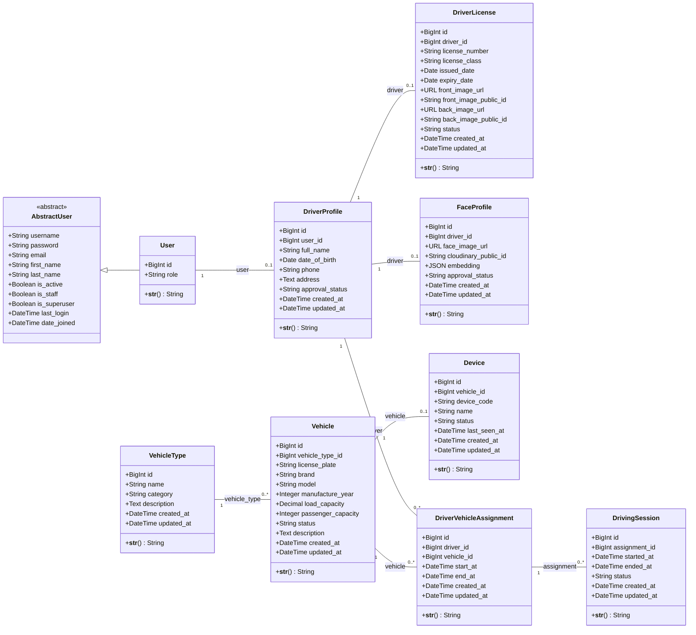

# Sơ đồ lớp theo mã nguồn hiện tại

9 model nghiệp vụ; AbstractUser là lớp cha của Django. Các lớp vi phạm trong README chưa được triển khai. Chi tiết thuộc tính, quan hệ và quy tắc nghiệp vụ: `mo_ta_so_do_lop.docx`.

Sao chép nội dung `so_do_lop.mmd` vào trình biên tập Mermaid, hoặc xem khối dưới đây trên trình đọc Markdown hỗ trợ Mermaid.

Tạo lại tài liệu từ thư mục gốc dự án: `python docs/generate_class_docs.py`.
