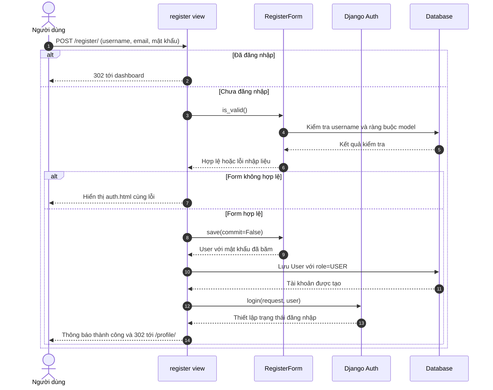
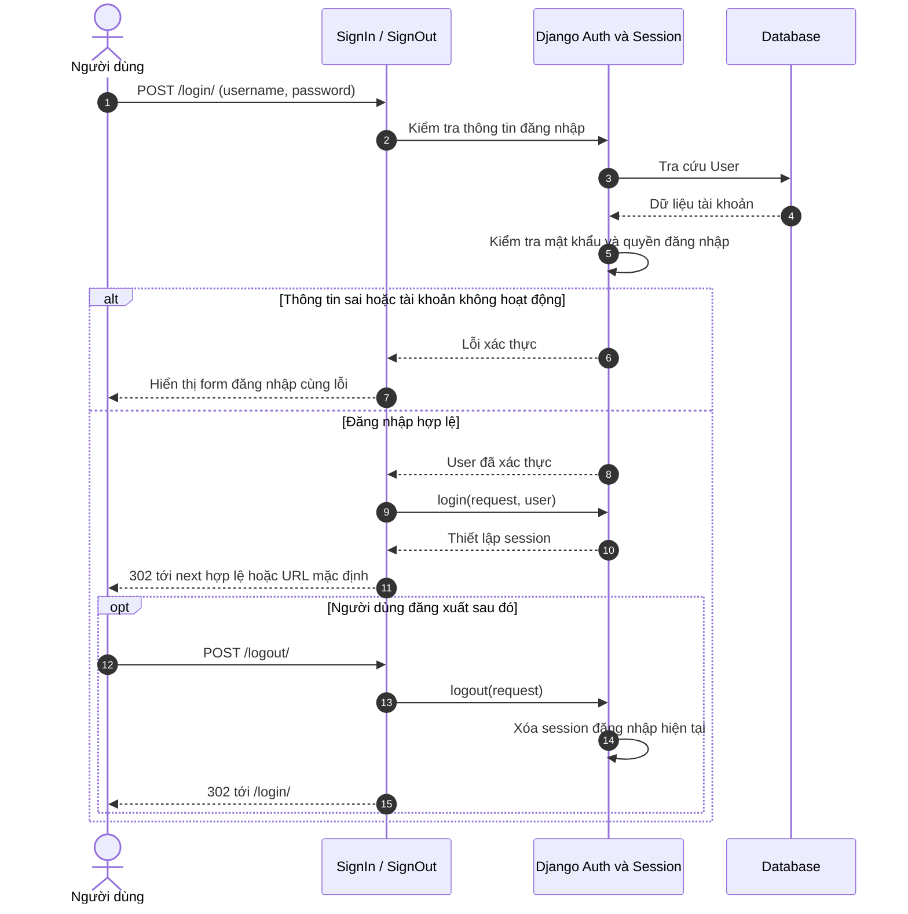
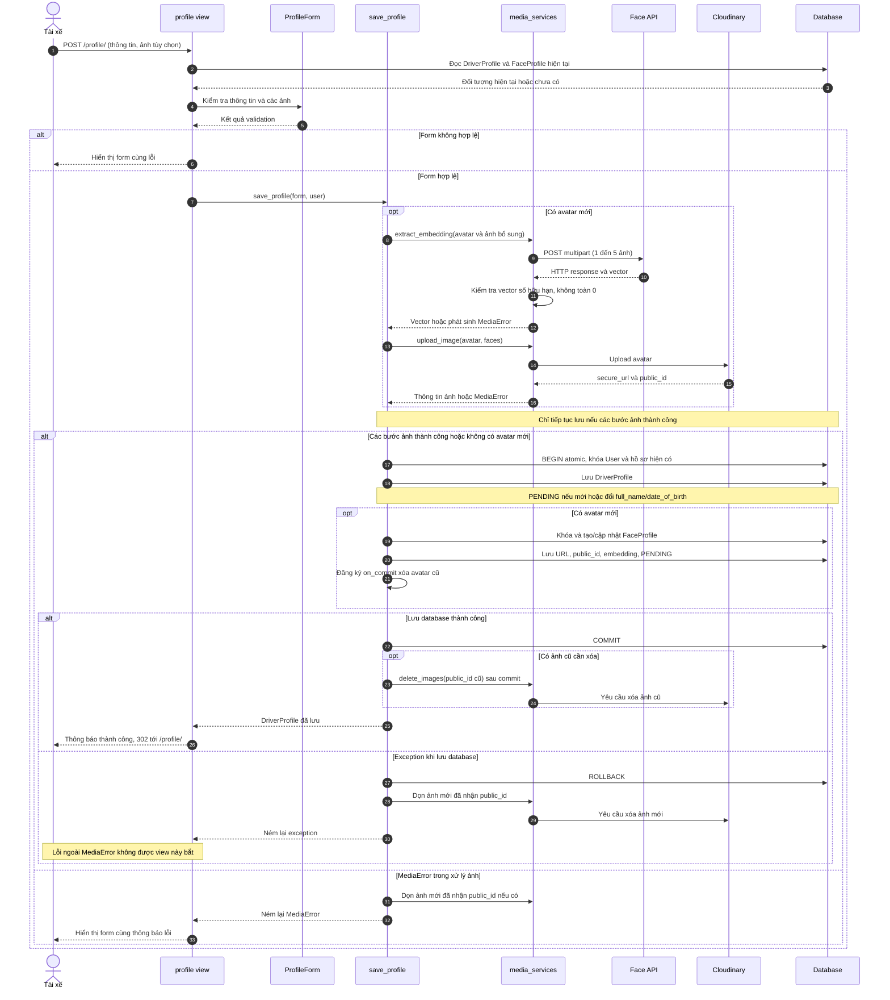
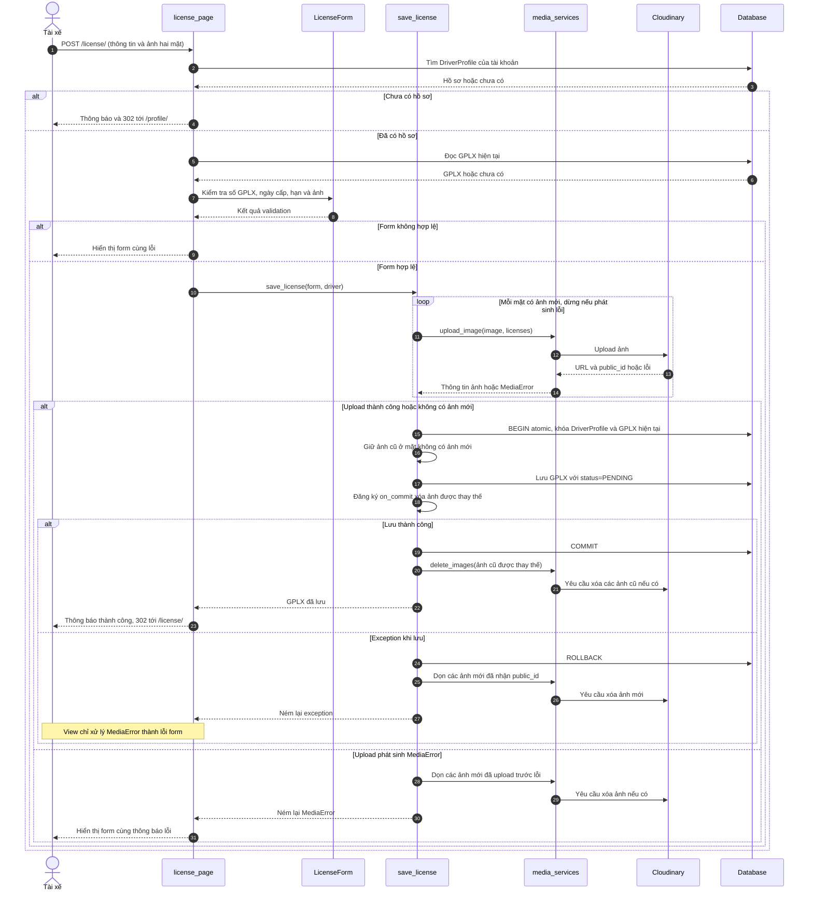
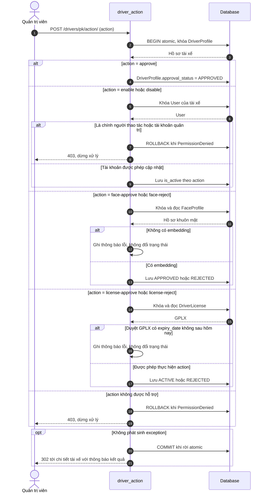
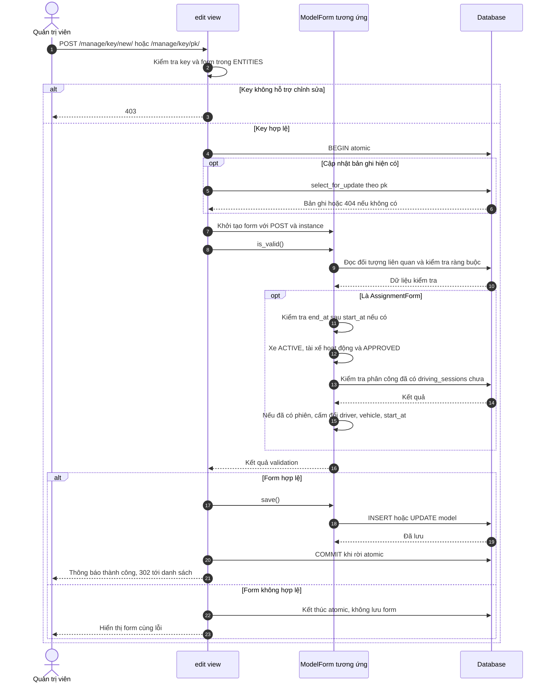
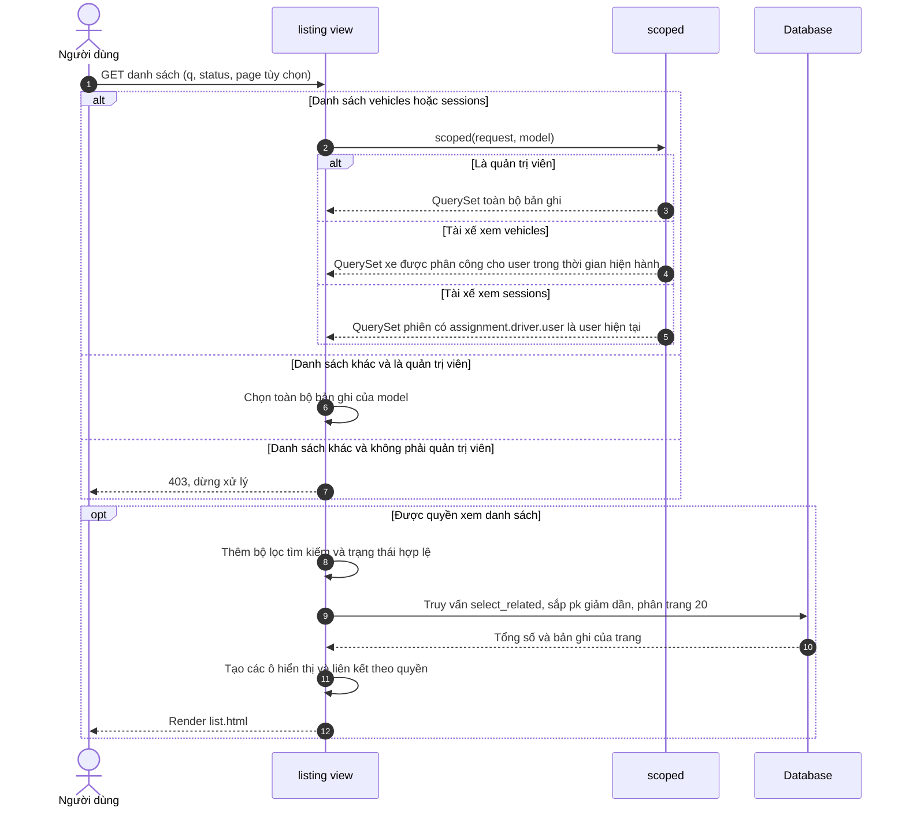

# Sơ đồ tuần tự

Các sơ đồ dưới đây mô tả luồng web đã triển khai, đối chiếu ngày 11/09/2026 với `frontend/views.py`, `frontend/forms.py`, `frontend/urls.py`, `accounts/profile_services.py` và `accounts/media_services.py`. Mỗi sơ đồ có file `.mmd` riêng trong `docs/sequence/`; sao chép nội dung file vào trình biên tập Mermaid để vẽ.

Quy ước: mũi tên liền là lời gọi/yêu cầu, mũi tên đứt là phản hồi; `alt` là nhánh điều kiện, `opt` là bước tùy chọn, `loop` là vòng lặp. Các truy vấn ORM được gom theo mục đích nghiệp vụ. DB biểu diễn cơ sở dữ liệu qua Django ORM. Các URL là đường dẫn trong `frontend/urls.py`.

Các luồng yêu cầu đăng nhập dùng session Django; chưa đăng nhập sẽ được chuyển tới trang đăng nhập. Luồng quản trị chỉ cho phép tài khoản có `role=ADMIN` hoặc `is_superuser=True`; sai quyền trả về 403. Các POST chịu kiểm tra CSRF của Django. Những bước bảo vệ chung này được lược bớt trong sơ đồ nghiệp vụ.

## 1. Đăng ký tài khoản

File: [01_dang_ky.mmd](sequence/01_dang_ky.mmd). Nguồn: `register`, `RegisterForm`.

Đăng ký chỉ tạo User; DriverProfile được tạo khi người dùng lưu hồ sơ.

## 2. Đăng nhập và đăng xuất

File: [02_dang_nhap_dang_xuat.mmd](sequence/02_dang_nhap_dang_xuat.mmd). Nguồn: `SignIn(LoginView)`, `SignOut(LogoutView)`. Sơ đồ gom các bước xác thực và quản lý session do Django cung cấp.

## 3. Lưu hồ sơ và tạo embedding khuôn mặt

File: [03_luu_ho_so.mmd](sequence/03_luu_ho_so.mmd). Nguồn: `profile`, `ProfileForm`, `save_profile`, `extract_embedding`, `upload_image`, `delete_images`. Điều kiện: người dùng đã đăng nhập và không phải quản trị viên.

Nếu Face API lỗi, luồng dừng trước upload avatar và trước transaction lưu hồ sơ. Các mũi tên sau phản hồi lỗi trong nhóm xử lý ảnh không được thực thi. `delete_images` ghi log khi xóa thất bại, không ném lỗi để hoàn tác dữ liệu đã lưu; sơ đồ không cam kết Cloudinary luôn được dọn sạch.

## 4. Thêm hoặc cập nhật giấy phép lái xe

File: [04_luu_gplx.mmd](sequence/04_luu_gplx.mmd). Nguồn: `license_page`, `LicenseForm`, `save_license`. Điều kiện: tài xế đã đăng nhập.

Form yêu cầu ảnh cho mặt chưa có URL, ngày cấp không ở tương lai và GPLX còn hạn. Dọn ảnh là thao tác cố gắng thực hiện; lỗi dọn ảnh được ghi log.

## 5. Quản trị duyệt hồ sơ, khuôn mặt, GPLX và khóa tài khoản

File: [05_duyet_tai_xe.mmd](sequence/05_duyet_tai_xe.mmd). Nguồn: `driver_action`. Điều kiện: đã qua `admin_required` và request là POST; tài nguyên không tồn tại trả 404.

Trong nhánh thiếu embedding hoặc GPLX hết hạn khi duyệt, view trả về sớm với thông báo lỗi và không ghi thông báo thành công. `face-reject` cũng yêu cầu embedding theo mã hiện tại.

## 6. Quản trị tạo hoặc cập nhật dữ liệu quản lý

File: [06_quan_ly_du_lieu.mmd](sequence/06_quan_ly_du_lieu.mmd). Nguồn: `edit`, `ENTITIES` và các ModelForm. Áp dụng cho `vehicles`, `catalogs`, `assignments`, `devices`; sơ đồ có nhánh kiểm tra phân công xe.

`VehicleForm` kiểm tra thông số theo nhóm TRUCK/BUS và năm sản xuất. `VehicleTypeForm` không cho đổi nhóm của loại xe đang được dùng. `DeviceForm` dùng kiểm tra ModelForm, gồm tính duy nhất mã thiết bị và liên kết một–một với xe. Luồng phân công hiện không kiểm tra trùng khoảng thời gian. Nếu phát sinh exception trong atomic thì transaction bị rollback; sơ đồ chỉ triển khai chi tiết nhánh validation thông thường.

## 7. Xem danh sách theo quyền người dùng

File: [07_xem_danh_sach.mmd](sequence/07_xem_danh_sach.mmd). Nguồn: `listing`, `scoped`. Điều kiện: đã đăng nhập.

Phân công hiện hành có `start_at <= now` và (`end_at IS NULL` hoặc `end_at > now`). Danh sách xe tài xế dùng `distinct()`. Danh sách phiên của tài xế không giới hạn theo thời hạn phân công. `QuerySet` được xây dựng trước và thực thi khi lấy dữ liệu/phân trang; các mũi tên truy vấn thể hiện mức khái quát.

## Phạm vi chưa triển khai

Chưa vẽ luồng bắt đầu/kết thúc phiên lái, xác thực khuôn mặt trước khi lái, nhận vi phạm từ AI, duyệt vi phạm hoặc gửi/xử lý kháng cáo như chức năng đang hoạt động. `DrivingSession` hiện được dùng để xem dữ liệu; `/violations/` và `/appeals/` trỏ tới trang `deferred`. Tạo embedding khi lưu hồ sơ ở sơ đồ 3 không phải là xác thực danh tính trước phiên lái.
